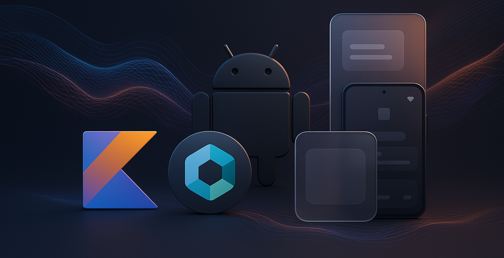

  

<h1 align="center">Talisson Vitorino</h1>

  Mobile Engineer (Android/iOS/KMP) • Building AI Agent Tooling for Developers

  Kotlin • Kotlin Multiplatform • Compose Multiplatform • Swift/SwiftUI • Ktor

  

---

## Sobre

Desenvolvedor Mobile com foco em Kotlin Multiplatform (KMP), construindo aplicativos nativos para Android e iOS que compartilham lógica de negócio sem abrir mão de experiência 100% nativa em cada plataforma.

Trabalho da camada de domínio à interface: Compose Multiplatform, Ktor, Coroutines/Flow e Clean Architecture (MVVM/MVI), sempre buscando reduzir duplicação de código entre plataformas sem sacrificar performance ou UX nativa.

Também construo ferramentas para acelerar o desenvolvimento mobile assistido por IA: sou autor do kmp-ios-skills, biblioteca open source com 105 agent skills para Claude Code, Cursor, GitHub Copilot, Codex e Gemini, especializadas em arquitetura Kotlin Multiplatform e iOS.

Atualmente cursando pós-graduação em Engenharia de Software (PUC Minas).

---

## Projetos em destaque

🏋️ **Treinouuu** — app full-stack em KMP (Android + iOS + backend em Ktor) que conecta aluno e personal trainer em tempo real. Produto solo: arquitetura, design de produto e evolução contínua.

🤖 **[kmp-ios-skills](https://github.com/TalissonVitorino/kmp-ios-skills)** — projeto open source (MIT) com 105 agent skills para desenvolvimento mobile assistido por IA, compatível com os principais agentes de código do mercado.

📱 **o.pick** — atuação em design de produto e desenvolvimento de app em KMP, arquitetura offline-first.

---

## Especialidades

- Aplicativos Android e iOS com Kotlin Multiplatform (KMP)
- Compose Multiplatform e Jetpack Compose
- APIs REST e backend com Ktor
- Clean Architecture, MVVM/MVI
- Coroutines/Flow, Room, Retrofit
- Testes automatizados (JUnit, MockK)
- Ferramentas de IA para desenvolvimento (Claude Code, Cursor, Copilot)

## Tecnologias

  
  
  
  
  
  

---

Aberto a oportunidades Mobile / KMP / iOS. 📫 talissonv57@gmail.com
